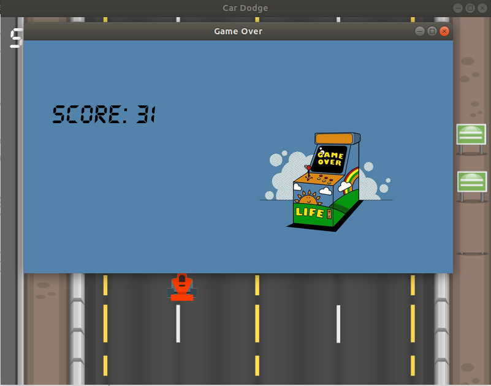

# Car Dodge
C++ game using SFML. 

This repo consists of car dodging game build up solely in c++ using Simple and Fast Multimedia Library(SFML).
You will be given three lives at first, whenever you bang on any car, you loose a life. All cars position would reset at this point without altering the gamespeed. Once all lives are gone, the game will turn off automatically. You can move the car using arrow keys or
A, S, D and W keys.

### Installation and Requirements
This game is designed for Ubuntu 18.04.03 or higher versions. Although it can be run cross platform using appropriate SFML libraries at compile time. 
Use V S code for better experience. Clone the project to your local system, put all the files shown in a folder.
> Install all SFML libraries into your system.

### Compilation and Running

> In terminal, cd to your current directory.

 Compile all your files separately or use 
 
> g++ -c *.cpp (this compiles all the files present in current directory)

Now, we need to link all the object files created after compilation(here three) and integrate SFML libraries:
> g++ -o final main.o obs.o car.o -lsfml-system -lsfml-window -lsfml-graphics (final is the resutant executable's file name)

Finally, to run the game :
> ./final

If everything works fine, you will see the game working.

Have a look

On loosing all the lives, GAME OVER!!

